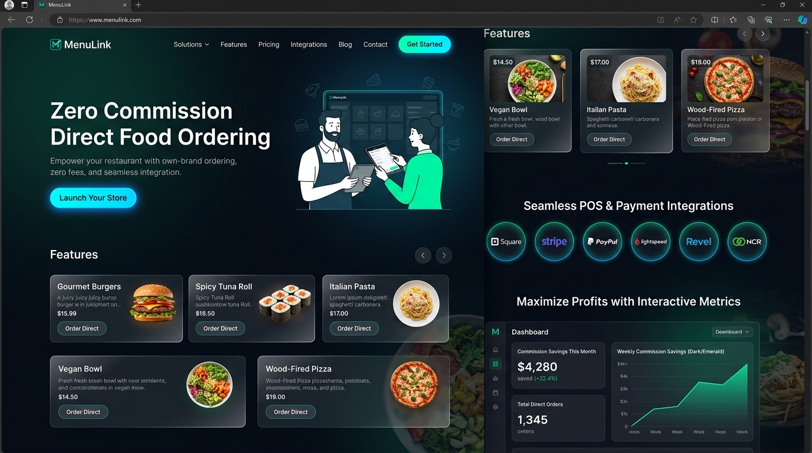
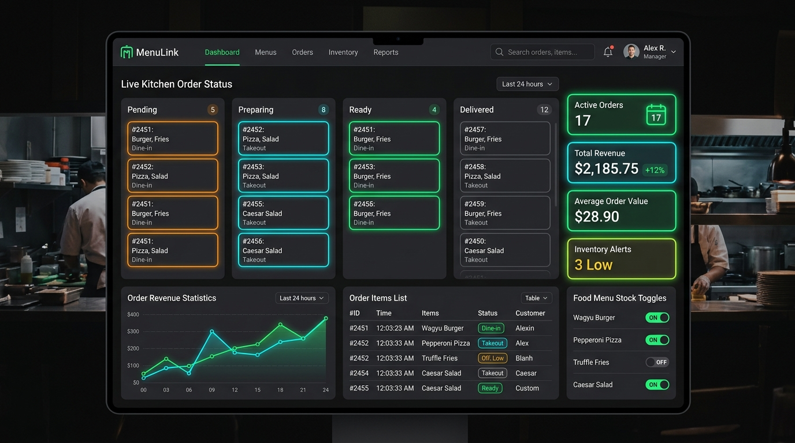
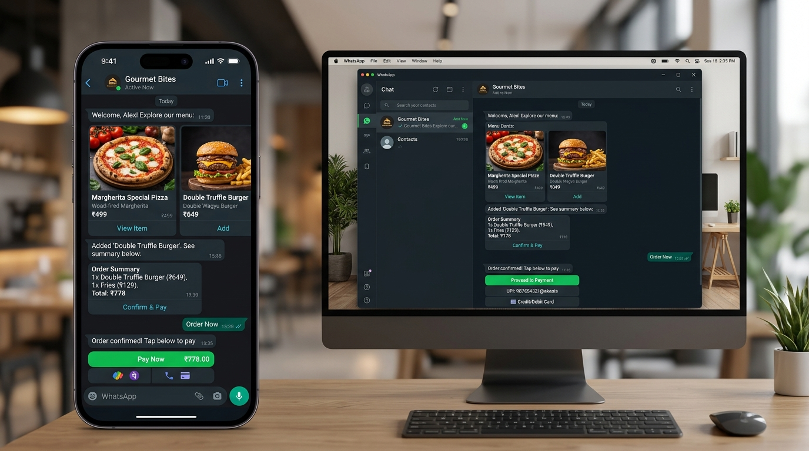
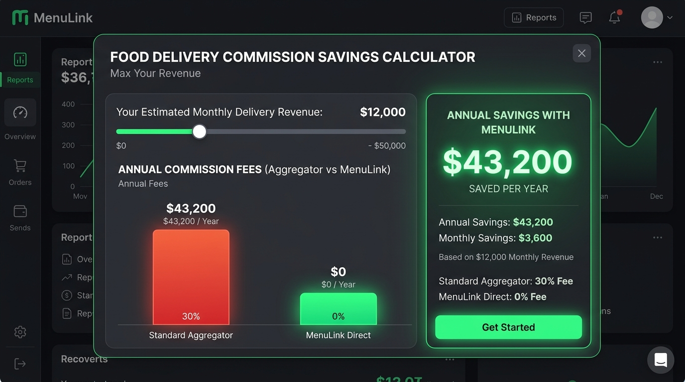

# 🍔 MenuLink — Direct Food Delivery & Restaurant Platform

> **Empowering Restaurants with 0% Commission Direct Online Ordering, WhatsApp AI Automation, and Live Admin Portal.**



---

## 📌 Table of Contents
- [Overview](#-overview)
- [Visual Showcase](#-visual-showcase)
- [Key Features](#-key-features)
- [Technology Stack](#-technology-stack)
- [Project Architecture](#-project-architecture)
- [Getting Started](#-getting-started)
  - [Prerequisites](#prerequisites)
  - [Backend Setup](#1-backend-setup)
  - [Database Seeding](#2-database-seeding)
  - [Frontend Setup](#3-frontend-setup)
- [API Endpoints](#-api-endpoints)
- [Default Admin Credentials](#-default-admin-credentials)
- [Deployment](#-deployment)
- [License](#-license)

---

## 🌟 Overview

**MenuLink** is an end-to-end, zero-commission direct ordering system built for restaurants, cloud kitchens, fine dining establishments, and quick-service outlets. Traditional food aggregators charge **25% – 35% commission** on every single order, eroding restaurant profit margins. 

MenuLink restores financial freedom to food businesses by providing:
1. **A Direct Digital Storefront** for customers to browse menus and place orders directly.
2. **Automated WhatsApp AI Chat Ordering** for instant friction-free ordering via chat messaging.
3. **A Live Administrative Portal** for real-time order tracking, menu inventory management, and revenue analytics.
4. **Aggregator Savings Analytics** helping owners track thousands of dollars saved monthly.

---

## 📸 Visual Showcase

### 1. Direct Online Ordering Storefront & Hero
*Sleek, high-converting digital storefront with glassmorphism UI, interactive POS badges, and instant checkout.*


---

### 2. Live Restaurant Admin Portal & Order Tracking
*Comprehensive kitchen management interface featuring real-time order status tracking (Pending, Preparing, Out for Delivery, Delivered), stock management, and sales analytics.*


---

### 3. WhatsApp AI & Chat Ordering Assistant
*Interactive conversational food ordering experience allowing customers to view menus, customize orders, and pay directly inside WhatsApp/Chat.*


---

### 4. Interactive Aggregator Cost & Savings Visualizer
*Financial visualizer demonstrating exact savings of 0% MenuLink direct ordering versus 30% aggregator commission fees.*


---

## 🔥 Key Features

- ⚡ **0% Commission Direct Ordering**: Eliminate high third-party aggregator cuts and retain 100% of order profits.
- 📱 **WhatsApp AI Chat Widget**: Interactive chat widget allowing customers to browse dishes, specify custom notes, and trigger instant orders.
- 👨‍🍳 **Real-Time Kitchen Kanban Board**: Manage incoming orders through structured order states: `Pending`, `Preparing`, `Out for Delivery`, and `Delivered`.
- 📊 **Dynamic Savings Calculator**: Live slider to compute projected annual savings based on monthly order volume and average ticket size.
- 🍲 **Instant Menu & Stock Management**: Toggle dish availability on the fly, edit prices, categories, and descriptions seamlessly.
- 🔌 **POS & Logistics Integrations Ready**: Built-in visual support for Petpooja, UrbanPiper, Toast, Square, POSist, Dunzo, and Shadowfax.
- 🔐 **JWT-Based Admin Authentication**: Secure login system with token verification and protected routes.
- 🌐 **Responsive Glassmorphic Design**: Modern dark theme with fluid animations, glowing metrics cards, and micro-interactions.

---

## 🛠 Technology Stack

### Frontend
- **Framework**: [React 18](https://react.dev/) + [Vite](https://vitejs.dev/)
- **Icons**: [Lucide React](https://lucide.dev/)
- **Routing**: Client-side hash & history routing with state synchronization
- **Styling**: Vanilla CSS (Custom Glassmorphism, CSS Variables, Responsive Grid/Flexbox)

### Backend
- **Runtime**: [Node.js](https://nodejs.org/)
- **Framework**: [Express.js](https://expressjs.com/)
- **Database**: [MongoDB](https://www.mongodb.com/) via [Mongoose ORM](https://mongoosejs.com/)
- **Authentication**: JWT (JSON Web Tokens) & `bcryptjs` password hashing
- **Security & CORS**: Enabled cross-origin requests & environment configuration (`dotenv`)

### Deployment Configuration
- Ready for deployment on **Vercel**, **Netlify**, or **Render** with pre-configured configuration files (`vercel.json`, `netlify.toml`, `render.yaml`).

---

## 📁 Project Architecture

```
food-delivery/
├── assets/
│   └── images/                     # Screenshots and graphics for documentation
│       ├── menulink-hero.jpg
│       ├── admin-portal.jpg
│       ├── whatsapp-ordering.jpg
│       └── savings-calculator.jpg
├── backend/                        # Express.js REST API Server
│   ├── config/                     # Database connection configuration (db.js)
│   ├── controllers/                # Controller logic for auth, menu, orders, etc.
│   ├── models/                     # Mongoose schemas (Admin, Menu, Order, Payment, Restaurant)
│   ├── routes/                     # API routes definition
│   ├── seed.js                     # Seed script for initial database setup
│   ├── server.js                   # Node Express server entry point
│   └── .env.example                # Sample environment variables for backend
├── public/                         # Public assets & rewrite rules
│   └── _redirects
├── src/                            # React Application Source
│   ├── components/                 # Reusable UI components
│   │   ├── AdminLogin.jsx          # Admin authentication modal/page
│   │   ├── AdminPortal.jsx         # Main administrative dashboard & order manager
│   │   ├── AggregatorCostVisualizer.jsx
│   │   ├── ChatWidget.jsx          # Live WhatsApp / AI Chat assistant widget
│   │   ├── ComparisonTable.jsx     # Side-by-side aggregator vs MenuLink feature table
│   │   ├── Hero.jsx                # Landing page hero banner
│   │   ├── Navbar.jsx              # Navigation header with admin toggle
│   │   ├── RegistrationSection.jsx # Restaurant partner onboarding form
│   │   ├── SavingsCalculator.jsx   # Interactive 0% commission calculator
│   │   └── ... (21 modular components)
│   ├── services/                   # API service integration helpers
│   ├── styles/                     # CSS stylesheets per component domain
│   ├── App.jsx                     # Main root React component & route manager
│   └── main.jsx                    # Entry mount point
├── netlify.toml                    # Netlify deployment configuration
├── render.yaml                     # Render service manifest
├── vercel.json                     # Vercel deployment routes
└── package.json                    # Root scripts and frontend dependencies
```

---

## 🚀 Getting Started

### Prerequisites
Make sure you have the following installed on your system:
- **Node.js** (v18.0.0 or higher)
- **npm** (v9.0.0 or higher)
- **MongoDB** (Local instance or MongoDB Atlas cluster URI)

---

### 1. Backend Setup

1. Navigate into the `backend` directory:
   ```bash
   cd backend
   ```
2. Install dependencies:
   ```bash
   npm install
   ```
3. Create a `.env` file inside `backend/` directory (or copy from `.env.example`):
   ```env
   PORT=5000
   MONGO_URI=mongodb://127.0.0.1:27017/menulink_db
   JWT_SECRET=menulink_super_secret_jwt_key_2026
   NODE_ENV=development
   ```

---

### 2. Database Seeding

To populate MongoDB with sample admin credentials, sample restaurants, food menu items, test orders, and payment records:

```bash
npm run seed
```

Then start the backend server:
```bash
# Development mode with hot-reload
npm run dev

# Or standard production mode
npm start
```
*The backend API server will be available at `http://localhost:5000`.*  
*Check health status at `http://localhost:5000/api/health`.*

---

### 3. Frontend Setup

1. Return to the root directory:
   ```bash
   cd ..
   ```
2. Install dependencies:
   ```bash
   npm install
   ```
3. Start the Vite development server:
   ```bash
   npm run dev
   ```
4. Open your browser and navigate to `http://localhost:5173`.

---

## 🌐 API Endpoints

| Category | Endpoint | Method | Description |
| :--- | :--- | :--- | :--- |
| **Health** | `/api/health` | `GET` | Verify backend server status and version |
| **Auth** | `/api/admin/login` | `POST` | Authenticate admin user & receive JWT |
| **Auth** | `/api/admin/me` | `GET` | Get current logged-in admin profile |
| **Restaurants**| `/api/restaurants` | `GET` / `POST` | Fetch or update restaurant profile details |
| **Menu** | `/api/menu` | `GET` / `POST` | Get or add food menu items |
| **Menu** | `/api/menu/:id` | `PUT` / `DELETE`| Update dish details/stock or remove dish |
| **Orders** | `/api/orders` | `GET` / `POST` | Fetch all orders or create a new order |
| **Orders** | `/api/orders/:id/status`| `PATCH` | Update order state (`Pending` ➔ `Preparing` ➔ `Out for Delivery` ➔ `Delivered`) |
| **Payments** | `/api/payments` | `GET` / `POST` | Process & fetch order payments |

---

## 🔑 Default Admin Credentials

After running `npm run seed` in the backend, you can log in to the **Admin Portal** using:

- **URL**: Click **"Admin Portal"** in the top navigation bar or navigate to `#admin`.
- **Email**: `admin@menulink.com`
- **Password**: `admin123`

---

## ☁️ Deployment

### Deploying Frontend (Vercel / Netlify)
- **Build Command**: `npm run build`
- **Output Directory**: `dist`
- **Redirects / SPA Routing**: Pre-configured in `public/_redirects`, `netlify.toml`, and `vercel.json`.

### Deploying Backend (Render / Railway / Heroku)
- **Environment Variables**: Set `MONGO_URI`, `JWT_SECRET`, and `NODE_ENV=production`.
- **Build Command**: `npm install`
- **Start Command**: `node server.js`

---

## 📄 License

This project is open-source and licensed under the **MIT License**.

---

<p center>
Made with ❤️ by MenuLink Team — Saving restaurants one order at a time! 🍕🍔🚀
</p>
